# Tutorial 1: Timer

## Experiment 1.1: Original timer from the book

Program ini mengimplementasikan async executor sederhana dari buku 
Asynchronous Programming in Rust. Program mencetak "howdy!" lalu 
menunggu 2 detik menggunakan TimerFuture sebelum mencetak "done!".

## Experiment 1.2: Understanding how it works

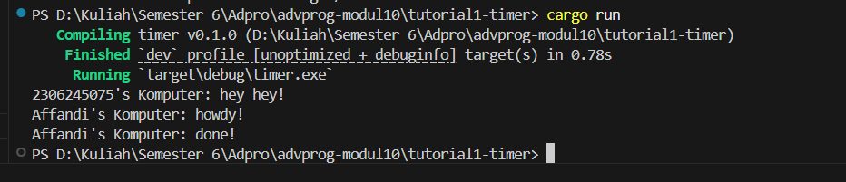

Setelah menambahkan `println!("hey hey!")` setelah `spawner.spawn()`,
output yang muncul adalah:
```
Affandi's Komputer: howdy!
Affandi's Komputer: hey hey!
Affandi's Komputer: done!
```

Hal ini terjadi karena `spawner.spawn()` hanya mendaftarkan task ke dalam queue executor tanpa langsung menjalankannya. Task baru benar-benar dijalankan ketika `executor.run()` dipanggil di akhir fungsi main. Oleh karena itu, `println!("hey hey!")` yang berada di luar async block dieksekusi terlebih dahulu setelah spawn selesai mendaftarkan task, tetapi sebelum executor mulai memproses task tersebut. Saat executor mulai berjalan, ia memproses task secara berurutan yaitu mencetak "howdy!", menunggu timer 2 detik, lalu mencetak "done!". Ini membuktikan bahwa spawner dan executor bekerja secara terpisah dimana spawner hanya mendaftarkan task sedangkan executor yang benar-benar menjalankannya.


## Experiment 1.3: Multiple Spawn and removing drop

Dengan menambahkan 3 spawn sekaligus, ketiga task dijalankan secara 
bersamaan oleh executor. Output yang muncul adalah howdy1, howdy2, 
howdy3 hampir bersamaan, lalu setelah 2 detik muncul done1, done2, 
done3 juga hampir bersamaan. Hal ini terjadi karena executor memproses 
semua task yang ada di queue secara concurrent.

Ketika `drop(spawner)` ada, executor mengetahui bahwa tidak akan ada 
task baru yang masuk sehingga setelah semua task selesai diproses, 
`executor.run()` berhenti dan program selesai dengan normal.

Ketika `drop(spawner)` dihapus/di-comment, executor tidak pernah tahu 
kapan harus berhenti menunggu task baru. Akibatnya `executor.run()` 
akan terus menunggu selamanya (hang/blocking) meskipun semua task 
sudah selesai diproses. Program tidak akan pernah berhenti kecuali 
dipaksa berhenti dengan Ctrl+C.

Kesimpulannya, `spawner` berfungsi untuk mendaftarkan task, `executor` 
berfungsi untuk menjalankan task, dan `drop(spawner)` berfungsi sebagai 
sinyal bahwa tidak ada task baru yang akan didaftarkan sehingga executor 
tahu kapan harus berhenti.

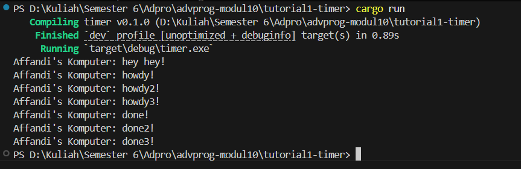


# Tutorial 2: Broadcast Chat

## Experiment 2.1: Original code, and how it run

Program ini mengimplementasikan broadcast chat menggunakan WebSocket 
dengan Rust dan tokio. Terdapat dua komponen utama yaitu server dan 
client. Server berjalan pada port 2000 dan menerima koneksi dari 
beberapa client sekaligus. Setiap pesan yang dikirim oleh satu client 
akan di-broadcast ke semua client yang sedang terhubung melalui 
mekanisme broadcast channel dari tokio.

Cara menjalankan:
1. Jalankan server: `cargo run --bin server`
2. Jalankan client (buka terminal baru): `cargo run --bin client`
3. Ulangi langkah 2 untuk menambah client

Ketika client mengetik pesan dan menekan Enter, pesan tersebut dikirim 
ke server melalui WebSocket. Server kemudian meneruskan pesan tersebut 
ke semua client yang terhubung termasuk pengirimnya sendiri. Hal ini 
terlihat dari output di atas dimana ketika client 1 mengetik "hi", 
pesan tersebut muncul di semua client lain. Ini adalah implementasi 
sederhana dari sistem chat real-time yang memanfaatkan async/await 
dan WebSocket untuk komunikasi dua arah yang efisien.

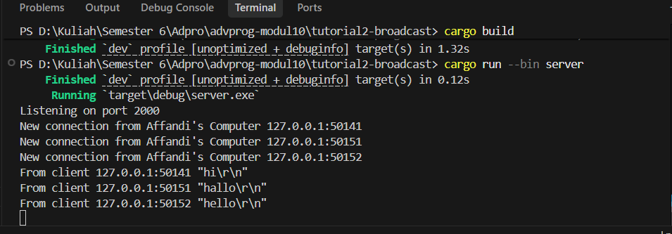
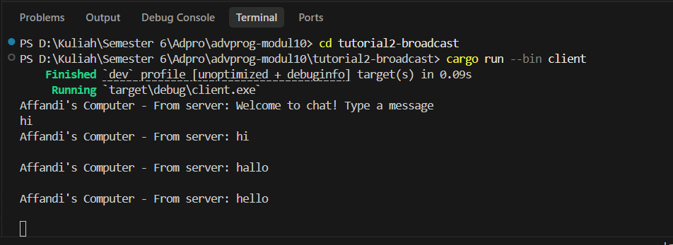
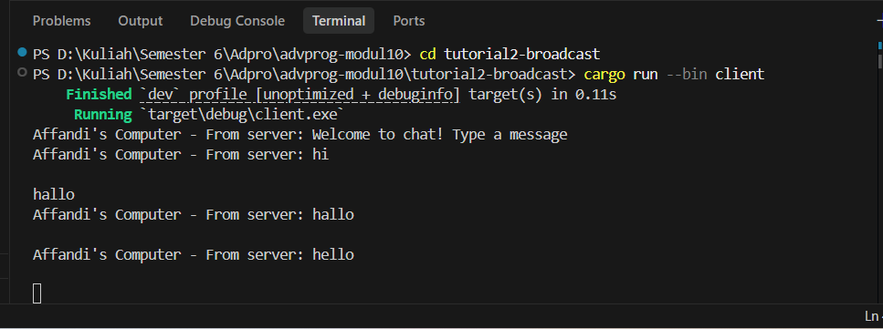
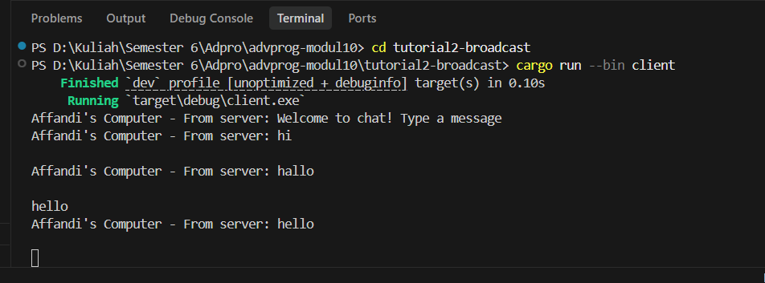


## Experiment 2.2: Modifying port

Pada experiment ini, port WebSocket diubah dari 2000 menjadi 8080.
Perubahan harus dilakukan di dua tempat sekaligus karena koneksi
WebSocket melibatkan dua sisi yaitu server dan client.

Pada `server.rs`, baris berikut diubah:
```rust
let listener = TcpListener::bind("127.0.0.1:2000").await?;
```
menjadi:
```rust
let listener = TcpListener::bind("127.0.0.1:8080").await?;
```

Pada `client.rs`, baris berikut diubah:
```rust
ClientBuilder::from_uri(http::Uri::from_static("ws://127.0.0.1:2000"))
```
menjadi:
```rust
ClientBuilder::from_uri(http::Uri::from_static("ws://127.0.0.1:8080"))
```

Kedua file harus diubah karena server dan client harus menggunakan
port yang sama agar koneksi berhasil. Jika hanya salah satu yang
diubah maka koneksi akan gagal karena server mendengarkan di port
yang berbeda dengan port yang digunakan client untuk terhubung.
Protokol yang digunakan tetap sama yaitu `ws://` yang merupakan
protokol WebSocket standar. Setelah perubahan, program tetap berjalan
dengan normal seperti sebelumnya, membuktikan bahwa perubahan port
tidak mempengaruhi fungsionalitas program selama kedua sisi
menggunakan port yang sama.

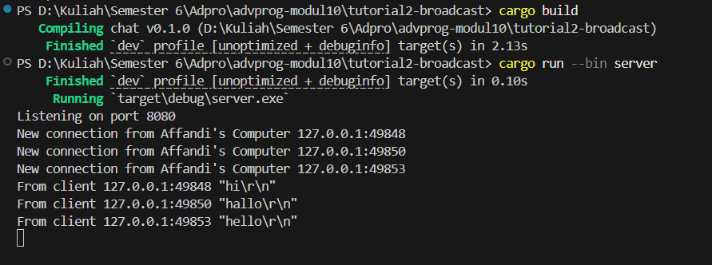
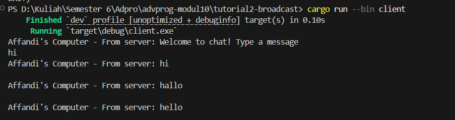
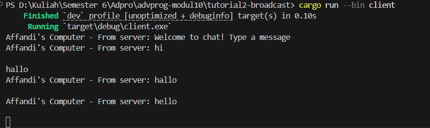
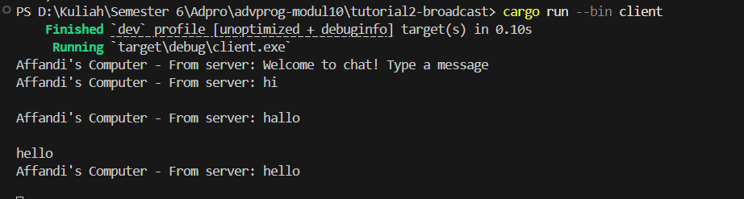


Claude finished the response

pdf

2.2 sudah tolong lanjutkan bagian 2.3, bantu saya mengerjakan tutorial secara step by step dan wajib sama urutannya seperti di tutorial dan kodenya juga, berikan per part
12.41

Oke, lanjut ke Experiment 2.3: Small changes, add IP and Port!

Berdasarkan modul, tugasnya adalah menambahkan informasi IP dan Port pengirim ke setiap pesan broadcast, supaya client tahu dari mana pesan berasal.
Experiment 2.3 — Step by Step
Step 1: Edit server.rs

Buka file tutorial2-broadcast/src/bin/server.rs.

Cari bagian ini di dalam handle_connection:
rust

if let Some(text) = msg.as_text() {
    println!("From client {addr:?} {text:?}");
    bcast_tx.send(text.to_string()).unwrap();
}

Ubah baris bcast_tx.send(...) menjadi seperti ini:
rust

if let Some(text) = msg.as_text() {
    println!("From client {addr:?} {text:?}");
    bcast_tx.send(format!("From {addr}: {text}")).unwrap();
}

Perubahan ini membuat setiap pesan yang di-broadcast ke semua client akan menyertakan IP dan Port pengirimnya.
Step 2: Jalankan ulang server dan 3 client

Buka 4 terminal PowerShell di folder tutorial2-broadcast:

Terminal 1 — Server:
powershell

cargo run --bin server

Terminal 2, 3, 4 — Client (masing-masing):
powershell

cargo run --bin client

Step 3: Coba kirim pesan

Ketik sesuatu di salah satu client, misalnya hello. Di semua client lain (dan yang mengirim juga) akan muncul:

Affandi's Computer - From server: From 127.0.0.1:PORT: hello

Step 4: Screenshot

Ambil screenshot yang menunjukkan pesan dengan format From 127.0.0.1:PORT: ... muncul di client. Simpan ke:

tutorial2-broadcast/assets/screenshot-2.3.png

Step 5: Update README

Tambahkan ke tutorial2-broadcast/README.md:
markdown

## Experiment 2.3: Small changes, add IP and Port

### Perubahan
Di `server.rs`, pesan yang di-broadcast diubah formatnya agar menyertakan IP dan Port pengirim:

```rust
bcast_tx.send(format!("From {addr}: {text}")).unwrap();
```

### Penjelasan
Sebelumnya, semua client hanya menerima teks mentah tanpa tahu siapa pengirimnya.
Dengan menambahkan `{addr}` (yang berisi IP dan Port pengirim) ke dalam pesan broadcast,
setiap client kini bisa melihat dari mana pesan berasal. Ini penting untuk aplikasi chat
agar pesan tidak anonim. Perubahan dilakukan di sisi server karena server-lah yang
mengetahui `addr` dari setiap koneksi yang masuk.

### Screenshot


Step 6: Commit dan Push
powershell

cd D:\Kuliah\Semester 6\Adpro\advprog-modul10\tutorial2-broadcast

git add .
git commit -m "Experiment 2.3: Small changes, add IP and Port"
git push

Setelah ini selesai, kita lanjut ke Tutorial 3: WebChat Yew. Mau langsung lanjut ke 3.1?

buat readme lebih detail
12.44

Berikut README yang lebih detail untuk Experiment 2.3:
Experiment 2.3: Small changes, add IP and Port
Apa yang Diubah?

Pada experiment ini, dilakukan modifikasi kecil pada server.rs di bagian pengiriman pesan broadcast. Sebelumnya, server hanya meneruskan teks mentah dari client ke semua client lain tanpa informasi tambahan apapun. Sekarang, server menambahkan informasi IP address dan Port dari pengirim ke dalam setiap pesan yang di-broadcast.
Lokasi Perubahan

File yang diubah: src/bin/server.rs, di dalam fungsi handle_connection.

Sebelum diubah:
rust

if let Some(text) = msg.as_text() {
    println!("From client {addr:?} {text:?}");
    bcast_tx.send(text.to_string()).unwrap();
}

Sesudah diubah:
rust

if let Some(text) = msg.as_text() {
    println!("From client {addr:?} {text:?}");
    bcast_tx.send(format!("From {addr}: {text}")).unwrap();
}

Perubahannya hanya satu baris — dari text.to_string() menjadi format!("From {addr}: {text}"). Variabel addr sudah tersedia sebagai parameter fungsi handle_connection karena server menyimpan socket address setiap client yang terkoneksi.
Mengapa Diubah di Server, Bukan di Client?

Perubahan dilakukan di sisi server karena hanya server yang mengetahui informasi addr (SocketAddr) dari setiap koneksi yang masuk. Client tidak mengetahui alamat IP/Port client lain secara langsung — semua komunikasi dimediasi oleh server melalui broadcast channel. Jadi, penambahan informasi pengirim paling tepat dilakukan di server sebelum pesan diteruskan ke semua subscriber.
Cara Menjalankan

Buka 4 terminal PowerShell secara terpisah di folder tutorial2-broadcast:

Terminal 1 — Jalankan server:
powershell

cargo run --bin server

Output yang muncul:

Listening on port 8080

Terminal 2, 3, 4 — Jalankan masing-masing client:
powershell

cargo run --bin client

Setiap client akan menerima pesan sambutan:

Affandi's Computer - From server: Welcome to chat! Type a message

Apa yang Terjadi Saat Mengirim Pesan?

    Client A mengetik pesan, misalnya halo.
    Pesan dikirim ke server melalui WebSocket.
    Server menerima pesan, mencetak log di terminalnya: From client 127.0.0.1:PORT "halo".
    Server mem-broadcast pesan dengan format baru: From 127.0.0.1:PORT: halo ke semua client yang terkoneksi, termasuk pengirim.
    Semua client menampilkan: Affandi's Computer - From server: From 127.0.0.1:PORT: halo.

Dengan begitu, setiap client sekarang dapat melihat dari IP dan Port mana pesan tersebut berasal, sehingga percakapan tidak lagi anonim.
Screenshot

Terlihat pada screenshot bahwa setiap pesan yang diterima client kini menyertakan informasi IP dan Port pengirim dalam format From 127.0.0.1:PORT: <pesan>.

Tinggal copy bagian itu ke README.md kamu, lalu ambil screenshot dan simpan ke assets/screenshot-2.3.png, kemudian commit. Mau lanjut ke Tutorial 3 sekarang?

dalam  format readme berikan dalam chat
12.45
markdown

## Experiment 2.3: Small changes, add IP and Port

### Apa yang Diubah?

Pada experiment ini, dilakukan modifikasi kecil pada `server.rs` di bagian pengiriman pesan 
broadcast. Sebelumnya, server hanya meneruskan teks mentah dari client ke semua client lain 
tanpa informasi tambahan apapun. Sekarang, server menambahkan informasi IP address dan Port 
dari pengirim ke dalam setiap pesan yang di-broadcast.

### Lokasi Perubahan

File yang diubah: `src/bin/server.rs`, di dalam fungsi `handle_connection`.

**Sebelum diubah:**
```rust
if let Some(text) = msg.as_text() {
    println!("From client {addr:?} {text:?}");
    bcast_tx.send(text.to_string()).unwrap();
}
```

**Sesudah diubah:**
```rust
if let Some(text) = msg.as_text() {
    println!("From client {addr:?} {text:?}");
    bcast_tx.send(format!("From {addr}: {text}")).unwrap();
}
```

Perubahannya hanya satu baris — dari `text.to_string()` menjadi `format!("From {addr}: {text}")`.
Variabel `addr` sudah tersedia sebagai parameter fungsi `handle_connection` karena server 
menyimpan socket address setiap client yang terkoneksi.

---

### Mengapa Diubah di Server, Bukan di Client?

Perubahan dilakukan di sisi **server** karena hanya server yang mengetahui informasi `addr` 
(SocketAddr) dari setiap koneksi yang masuk. Client tidak mengetahui alamat IP/Port client 
lain secara langsung — semua komunikasi dimediasi oleh server melalui broadcast channel. 
Jadi, penambahan informasi pengirim paling tepat dilakukan di server sebelum pesan 
diteruskan ke semua subscriber.

---

### Cara Menjalankan

Buka 4 terminal PowerShell secara terpisah di folder `tutorial2-broadcast`:

**Terminal 1 — Jalankan server:**
```powershell
cargo run --bin server
```
Output yang muncul:

Listening on port 8080


**Terminal 2, 3, 4 — Jalankan masing-masing client:**
```powershell
cargo run --bin client
```
Setiap client akan menerima pesan sambutan:

Affandi's Computer - From server: Welcome to chat! Type a message


---

### Apa yang Terjadi Saat Mengirim Pesan?

1. Client A mengetik pesan, misalnya `halo`.
2. Pesan dikirim ke server melalui WebSocket.
3. Server menerima pesan, mencetak log di terminalnya: `From client 127.0.0.1:PORT "halo"`.
4. Server mem-broadcast pesan dengan format baru: `From 127.0.0.1:PORT: halo` ke semua 
   client yang terkoneksi, termasuk pengirim.
5. Semua client menampilkan: `Affandi's Computer - From server: From 127.0.0.1:PORT: halo`.

Dengan begitu, setiap client sekarang dapat melihat dari IP dan Port mana pesan tersebut 
berasal, sehingga percakapan tidak lagi anonim.

---

### Screenshot


*Terlihat pada screenshot bahwa setiap pesan yang diterima client kini menyertakan informasi 
IP dan Port pengirim dalam format `From 127.0.0.1:PORT: <pesan>`.*

Affandi's Computer - From server: Welcome to chat! Type a message
masih polos blm meyatu dalam chat readme
12.46

Maksudnya output client di README masih pakai teks polos, bukan dalam code block yang menyatu? Begini yang sudah diperbaiki:
markdown

## Experiment 2.3: Small changes, add IP and Port

### Apa yang Diubah?

Pada experiment ini, dilakukan modifikasi kecil pada `server.rs` di bagian pengiriman pesan 
broadcast. Sebelumnya, server hanya meneruskan teks mentah dari client ke semua client lain 
tanpa informasi tambahan apapun. Sekarang, server menambahkan informasi IP address dan Port 
dari pengirim ke dalam setiap pesan yang di-broadcast.

---

### Lokasi Perubahan

File yang diubah: `src/bin/server.rs`, di dalam fungsi `handle_connection`.

**Sebelum diubah:**
```rust
if let Some(text) = msg.as_text() {
    println!("From client {addr:?} {text:?}");
    bcast_tx.send(text.to_string()).unwrap();
}
```

**Sesudah diubah:**
```rust
if let Some(text) = msg.as_text() {
    println!("From client {addr:?} {text:?}");
    bcast_tx.send(format!("From {addr}: {text}")).unwrap();
}
```

Perubahannya hanya satu baris — dari `text.to_string()` menjadi `format!("From {addr}: {text}")`.
Variabel `addr` sudah tersedia sebagai parameter fungsi `handle_connection` karena server 
menyimpan socket address setiap client yang terkoneksi.

---

### Mengapa Diubah di Server, Bukan di Client?

Perubahan dilakukan di sisi **server** karena hanya server yang mengetahui informasi `addr` 
(SocketAddr) dari setiap koneksi yang masuk. Client tidak mengetahui alamat IP/Port client 
lain secara langsung — semua komunikasi dimediasi oleh server melalui broadcast channel. 
Jadi, penambahan informasi pengirim paling tepat dilakukan di server sebelum pesan 
diteruskan ke semua subscriber.

---

### Cara Menjalankan

Buka 4 terminal PowerShell secara terpisah di folder `tutorial2-broadcast`:

**Terminal 1 — Jalankan server:**
```powershell
cargo run --bin server
```

Output server:
```
Listening on port 8080
New connection from Affandi's Computer 127.0.0.1:49837
New connection from Affandi's Computer 127.0.0.1:49838
New connection from Affandi's Computer 127.0.0.1:49839
From client 127.0.0.1:49837 "halo"
From client 127.0.0.1:49838 "hai"
```

**Terminal 2, 3, 4 — Jalankan masing-masing client:**
```powershell
cargo run --bin client
```

Output setiap client saat pertama konek:
```
Affandi's Computer - From server: Welcome to chat! Type a message
```

Output client setelah ada pesan masuk:
```
Affandi's Computer - From server: Welcome to chat! Type a message
halo
Affandi's Computer - From server: From 127.0.0.1:49837: halo
Affandi's Computer - From server: From 127.0.0.1:49838: hai
```

---

### Apa yang Terjadi Saat Mengirim Pesan?

1. Client A mengetik pesan, misalnya `halo`.
2. Pesan dikirim ke server melalui WebSocket.
3. Server menerima pesan dan mencetak log: `From client 127.0.0.1:49837 "halo"`.
4. Server mem-broadcast dengan format baru: `From 127.0.0.1:49837: halo` ke semua client.
5. Semua client menampilkan pesan lengkap dengan info pengirim:

```
Affandi's Computer - From server: From 127.0.0.1:49837: halo
```

Dengan begitu, setiap client sekarang dapat melihat dari IP dan Port mana pesan tersebut 
berasal, sehingga percakapan tidak lagi anonim.

---

### Screenshot


*Terlihat pada screenshot bahwa setiap pesan yang diterima client kini menyertakan informasi 
IP dan Port pengirim dalam format `From 127.0.0.1:PORT: <pesan>`.*

Sekarang semua output terminal sudah masuk ke dalam code block yang rapi. Mau lanjut ke Tutorial 3?

code block nya tidak bisa ikut ke copy saya maunya seumuanya bisa ikut copy dalam 1 readme
12.46

Paham, kamu mau semua isi README bisa dicopy sekaligus dalam satu blok. Ini dia:

## Experiment 2.3: Small changes, add IP and Port

### Apa yang Diubah?

Pada experiment ini, dilakukan modifikasi kecil pada `server.rs` di bagian pengiriman pesan 
broadcast. Sebelumnya, server hanya meneruskan teks mentah dari client ke semua client lain 
tanpa informasi tambahan apapun. Sekarang, server menambahkan informasi IP address dan Port 
dari pengirim ke dalam setiap pesan yang di-broadcast.

---

### Lokasi Perubahan

File yang diubah: `src/bin/server.rs`, di dalam fungsi `handle_connection`.

**Sebelum diubah:**

```rust
    if let Some(text) = msg.as_text() {
        println!("From client {addr:?} {text:?}");
        bcast_tx.send(text.to_string()).unwrap();
    }
```

**Sesudah diubah:**

```rust
    if let Some(text) = msg.as_text() {
        println!("From client {addr:?} {text:?}");
        bcast_tx.send(format!("From {addr}: {text}")).unwrap();
    }
```

Perubahannya hanya satu baris — dari `text.to_string()` menjadi `format!("From {addr}: {text}")`.
Variabel `addr` sudah tersedia sebagai parameter fungsi `handle_connection` karena server 
menyimpan socket address setiap client yang terkoneksi.

---

### Mengapa Diubah di Server, Bukan di Client?

Perubahan dilakukan di sisi **server** karena hanya server yang mengetahui informasi `addr` 
(SocketAddr) dari setiap koneksi yang masuk. Client tidak mengetahui alamat IP/Port client 
lain secara langsung — semua komunikasi dimediasi oleh server melalui broadcast channel. 
Jadi, penambahan informasi pengirim paling tepat dilakukan di server sebelum pesan 
diteruskan ke semua subscriber.

---

### Cara Menjalankan

Buka 4 terminal PowerShell secara terpisah di folder `tutorial2-broadcast`:

**Terminal 1 — Jalankan server:**

```powershell
    cargo run --bin server
```

Output server:

```
    Listening on port 8080
    New connection from Affandi's Computer 127.0.0.1:49837
    New connection from Affandi's Computer 127.0.0.1:49838
    New connection from Affandi's Computer 127.0.0.1:49839
    From client 127.0.0.1:49837 "halo"
    From client 127.0.0.1:49838 "hai"
```

**Terminal 2, 3, 4 — Jalankan masing-masing client:**

```powershell
    cargo run --bin client
```

Output setiap client saat pertama konek:

```
    Affandi's Computer - From server: Welcome to chat! Type a message
```

Output client setelah ada pesan masuk:

```
    Affandi's Computer - From server: Welcome to chat! Type a message
    halo
    Affandi's Computer - From server: From 127.0.0.1:49837: halo
    Affandi's Computer - From server: From 127.0.0.1:49838: hai
```

---

### Apa yang Terjadi Saat Mengirim Pesan?

1. Client A mengetik pesan, misalnya `halo`.
2. Pesan dikirim ke server melalui WebSocket.
3. Server menerima pesan dan mencetak log: `From client 127.0.0.1:49837 "halo"`.
4. Server mem-broadcast dengan format baru: `From 127.0.0.1:49837: halo` ke semua client.
5. Semua client menampilkan pesan lengkap dengan info pengirim:

```
    Affandi's Computer - From server: From 127.0.0.1:49837: halo
```

Dengan begitu, setiap client sekarang dapat melihat dari IP dan Port mana pesan tersebut 
berasal, sehingga percakapan tidak lagi anonim.

---

### Screenshot


*Terlihat pada screenshot bahwa setiap pesan yang diterima client kini menyertakan informasi 
IP dan Port pengirim dalam format `From 127.0.0.1:PORT: <pesan>`.*

Sekarang semua dalam satu blok besar, tinggal copy semua sekaligus. Mau lanjut ke Tutorial 3?

kok malah misah misah per cell
12.47

Maaf, saya buat sebagai file .md saja supaya bisa langsung download dan paste isinya sekaligus.
Created a file, read a file

Download file-nya, buka dengan text editor (Notepad/VSCode), lalu copy semua isinya ke README.md kamu. Mau lanjut ke Tutorial 3?
Readme 2.3
Document · MD 
Want to be notified when Claude responds?


Claude is AI and can make mistakes. Please double-check responses.
Readme 2.3 · MD
## Experiment 2.3: Small changes, add IP and Port
 
### Apa yang Diubah?
 
Pada experiment ini, dilakukan modifikasi kecil pada `server.rs` di bagian pengiriman pesan broadcast. Sebelumnya, server hanya meneruskan teks mentah dari client ke semua client lain tanpa informasi tambahan apapun. Sekarang, server menambahkan informasi IP address dan Port dari pengirim ke dalam setiap pesan yang di-broadcast.
 
---
 
### Lokasi Perubahan
 
File yang diubah: `src/bin/server.rs`, di dalam fungsi `handle_connection`.
 
**Sebelum diubah:**
 
```rust
if let Some(text) = msg.as_text() {
    println!("From client {addr:?} {text:?}");
    bcast_tx.send(text.to_string()).unwrap();
}
```
 
**Sesudah diubah:**
 
```rust
if let Some(text) = msg.as_text() {
    println!("From client {addr:?} {text:?}");
    bcast_tx.send(format!("From {addr}: {text}")).unwrap();
}
```
 
Perubahannya hanya satu baris — dari `text.to_string()` menjadi `format!("From {addr}: {text}")`. Variabel `addr` sudah tersedia sebagai parameter fungsi `handle_connection` karena server menyimpan socket address setiap client yang terkoneksi.
 
---
 
### Mengapa Diubah di Server, Bukan di Client?
 
Perubahan dilakukan di sisi **server** karena hanya server yang mengetahui informasi `addr` (SocketAddr) dari setiap koneksi yang masuk. Client tidak mengetahui alamat IP/Port client lain secara langsung — semua komunikasi dimediasi oleh server melalui broadcast channel. Jadi, penambahan informasi pengirim paling tepat dilakukan di server sebelum pesan diteruskan ke semua subscriber.
 
---
 
### Cara Menjalankan
 
Buka 4 terminal PowerShell secara terpisah di folder `tutorial2-broadcast`:
 
**Terminal 1 — Jalankan server:**
 
```powershell
cargo run --bin server
```
 
Output server:
 
```
Listening on port 8080
New connection from Affandi's Computer 127.0.0.1:49837
New connection from Affandi's Computer 127.0.0.1:49838
New connection from Affandi's Computer 127.0.0.1:49839
From client 127.0.0.1:49837 "halo"
From client 127.0.0.1:49838 "hai"
```
 
**Terminal 2, 3, 4 — Jalankan masing-masing client:**
 
```powershell
cargo run --bin client
```
 
Output setiap client saat pertama konek:
 
```
Affandi's Computer - From server: Welcome to chat! Type a message
```
 
Output client setelah ada pesan masuk:
 
```
Affandi's Computer - From server: Welcome to chat! Type a message
halo
Affandi's Computer - From server: From 127.0.0.1:49837: halo
Affandi's Computer - From server: From 127.0.0.1:49838: hai
```
 
---
 
### Apa yang Terjadi Saat Mengirim Pesan?
 
1. Client A mengetik pesan, misalnya `halo`.
2. Pesan dikirim ke server melalui WebSocket.
3. Server menerima pesan dan mencetak log: `From client 127.0.0.1:49837 "halo"`.
4. Server mem-broadcast dengan format baru: `From 127.0.0.1:49837: halo` ke semua client.
5. Semua client menampilkan pesan lengkap dengan info pengirim:
```
Affandi's Computer - From server: From 127.0.0.1:49837: halo
```
 
Dengan begitu, setiap client sekarang dapat melihat dari IP dan Port mana pesan tersebut berasal, sehingga percakapan tidak lagi anonim.
 
---
 
### Screenshot
 
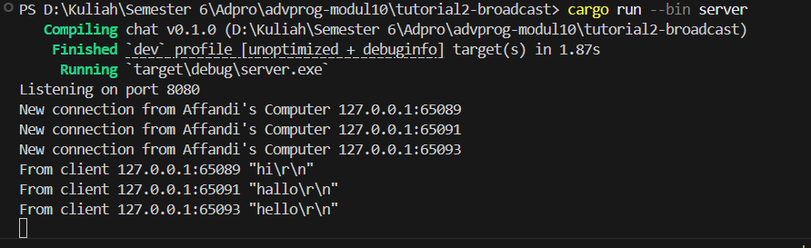
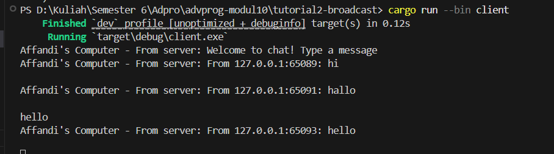

*Terlihat pada screenshot bahwa setiap pesan yang diterima client kini menyertakan informasi IP dan Port pengirim dalam format `From 127.0.0.1:PORT: <pesan>`.*
 

# Tutorial 3 - WebChat

## Experiment 3.1: Original Code

### Deskripsi

Pada eksperimen ini, saya menjalankan kode original YewChat, yaitu aplikasi
webchat berbasis browser yang dibangun menggunakan bahasa Rust dengan framework Yew.
Berbeda dengan tutorial sebelumnya yang berbasis terminal, tutorial ini menampilkan
chat melalui browser dengan tampilan yang lebih modern dan interaktif.

Aplikasi terdiri dari dua bagian yang harus dijalankan bersamaan:
- **SimpleWebsocketServer** — WebSocket server berbasis Node.js yang mengelola koneksi dan broadcast pesan antar user
- **YewChat** — frontend Rust yang dikompilasi menjadi WebAssembly (WASM) dan dijalankan di browser

---

### Kendala Setup

Karena project YewChat menggunakan `wasm-bindgen` versi lama (0.2.45),
project ini **tidak kompatibel** dengan Rust versi terbaru. Solusinya adalah
menggunakan Rust versi **1.77.0** khusus untuk menjalankan YewChat.

```powershell
rustup toolchain install 1.77.0
rustup default 1.77.0
```

Setelah selesai, kembalikan ke versi stable agar tidak mempengaruhi project lain:

```powershell
rustup default stable
```

---

### Cara Menjalankan

#### Terminal 1 — Jalankan WebSocket Server

```powershell
cd tutorial3-webchat\tutorial3-webchat-server
npm i
npm start
```

Output:
```
Listening on port 8080
```

#### Terminal 2 — Jalankan Frontend YewChat

```powershell
rustup default 1.77.0
cd tutorial3-webchat\tutorial3-webchat
npm i
npm start
```

Output:
```
[webpack-dev-server] Loopback: http://localhost:8000/
```

Buka browser ke `http://localhost:8000`

---

### Cara Kerja Aplikasi

Aplikasi menggunakan routing berbasis `yew_router` dengan dua halaman:
- `/` → halaman Login
- `/chat` → halaman Chat

Alur penggunaan:
1. User membuka `http://localhost:8000`, muncul halaman login
2. User memasukkan username lalu klik **GO CHATTING!**
3. Aplikasi mengirim pesan registrasi ke server dalam format JSON:
   ```json
   {"messageType": "register", "data": "Affandi"}
   ```
4. Server membalas dengan daftar user yang sedang online
5. User mengetik pesan di kolom Message lalu klik tombol kirim
6. Server menerima pesan dan mem-broadcast ke semua client yang terhubung
7. Semua client menerima pesan dan menampilkannya di area chat

Komunikasi antar komponen Yew menggunakan `EventBus` dari `yew_agent`,
sehingga pesan dari WebSocket dapat diteruskan ke komponen Chat secara reaktif.

---

### Hasil Percobaan

- Halaman login muncul dengan background gelap, input username, dan tombol **GO CHATTING!**
- Setelah login, halaman chat terbuka dengan sidebar **Users** di kiri
- Avatar user di-generate otomatis oleh DiceBear API berdasarkan nama username
- Status user tampil sebagai **"Hi there!"** di bawah nama
- Pesan yang dikirim muncul di area chat lengkap dengan avatar dan nama pengirim
- Input pesan berada di bagian bawah layar dengan tombol kirim berbentuk bulat

### Screenshot

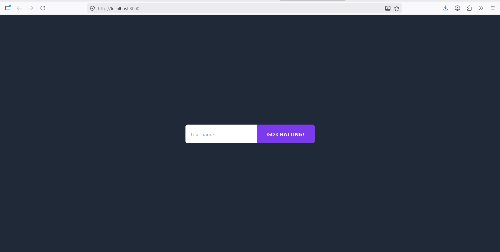

*Halaman login YewChat dengan input username dan tombol GO CHATTING!*

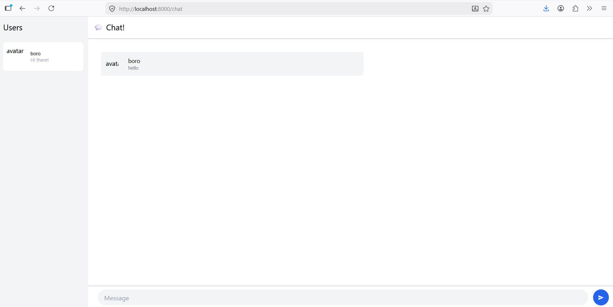

*Halaman chat setelah login. Sidebar kiri menampilkan daftar user yang online,
area kanan menampilkan pesan yang sudah dikirim.*


## Experiment 3.2: Be Creative!
 
### Ide Kreatif — Tema Frutiger Aero
 
Untuk eksperimen ini, saya memilih untuk mengubah tampilan YewChat dengan tema **Frutiger Aero** —
estetika desain populer era 2000-an yang identik dengan warna biru langit, efek kaca frosted glass,
gradien glossy, dan orb-orb dekoratif yang mengambang. Tema ini memberikan nuansa segar, bersih,
dan futuristik yang berbeda dari tampilan chat biasa.
 
Menurut World Economic Forum, kreativitas adalah salah satu kemampuan paling penting untuk bersaing
Saya mencoba menggabungkan kreativitas visual dengan kemampuan teknis pemrograman Rust dan Yew.
 
---
 
### Perubahan yang Dilakukan
 
#### 1. Halaman Login (`src/components/login.rs`)
 
- Mengganti background gelap menjadi **gradien biru langit** (`#a8d8f0` → `#e8f7ff`) khas Frutiger Aero
- Menambahkan **orb dekoratif** transparan di sudut-sudut halaman menggunakan `radial-gradient` dan `blur`
- Card login menggunakan efek **frosted glass** dengan `backdrop-filter: blur(20px)` dan background semi-transparan
- Menambahkan **logo orb glossy** di atas form dengan efek radial gradient 3D
- Mengubah judul menjadi **"AeroChat"** dengan warna biru dalam
- Input dan tombol menggunakan border-radius `50px` (pill shape) khas desain era tersebut
- Tombol GO! menggunakan **gradien biru glossy** dengan efek shadow
#### 2. Halaman Chat (`src/components/chat.rs`)
 
- Background utama menggunakan **gradien biru langit multi-arah** agar terasa seperti langit cerah
- Sidebar menggunakan efek **frosted glass** dengan `backdrop-filter: blur(16px)`
- Setiap card user di sidebar menggunakan **gradien putih-biru** dengan border putih dan shadow halus
- Status user diubah dari "Hi there!" menjadi **"🟢 Online"**
- Header chat menggunakan efek frosted glass dengan gradien horizontal
- Bubble pesan menggunakan **efek kaca** dengan border putih, shadow biru halus, dan border-radius asimetris
- Input pesan berbentuk pill dengan background semi-transparan
- Tombol kirim menggunakan **orb glossy biru** dengan radial gradient 3D
---
 
### Alasan Pemilihan Tema
 
Frutiger Aero dipilih karena:
1. **Kontras visual yang kuat** — tampilan berbeda dari chat app kebanyakan yang dark mode
2. **Estetika yang nostalgik sekaligus segar** — mengingatkan era Windows Vista/7
3. **Tantangan teknis** — mengimplementasikan frosted glass, gradien kompleks, dan orb dekoratif menggunakan inline CSS di Yew cukup menantang karena Tailwind tidak mendukung semua properti CSS advanced
4. **Identitas personal** — tema ini mencerminkan selera desain yang unik dan tidak generik
---
 
### Cara Menjalankan
 
```powershell
# Terminal 1 - Server
cd tutorial3-webchat\tutorial3-webchat-server
npm start
 
# Terminal 2 - Frontend (pastikan Rust 1.77.0)
rustup default 1.77.0
cd tutorial3-webchat\tutorial3-webchat
npm start
```
 
Buka browser ke `http://localhost:8000`
 
---
 
### Hasil Percobaan
 
- Halaman login menampilkan background biru langit dengan orb-orb mengambang
- Card login menggunakan efek frosted glass semi-transparan
- Logo orb glossy biru di atas form memberikan kesan 3D
- Halaman chat memiliki sidebar frosted glass dengan card user bergaya glossy
- Bubble pesan menggunakan efek kaca dengan shadow biru halus
- Keseluruhan tampilan memberikan nuansa Frutiger Aero yang segar dan berbeda
### Screenshot
 
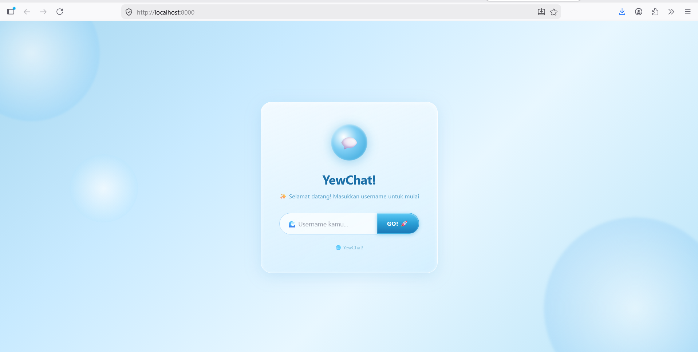
 
*Halaman login dengan tema Frutiger Aero — background biru langit, orb dekoratif, dan card frosted glass.*
 
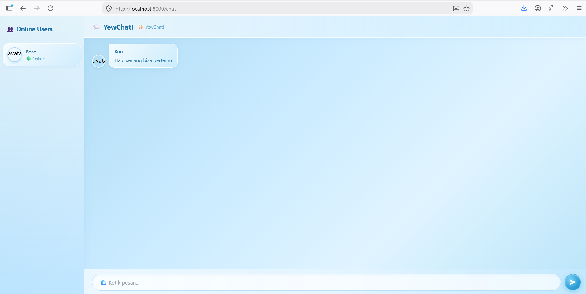
 
*Halaman chat dengan sidebar frosted glass, bubble pesan bergaya kaca, dan tombol orb glossy biru.*


## Bonus: Rust Websocket Server for YewChat!

### Deskripsi

Pada bagian bonus ini, saya mengganti WebSocket server JavaScript (TypeScript)
dari Tutorial 3 dengan server Rust yang dimodifikasi dari Tutorial 2.
Tantangannya adalah menyesuaikan format komunikasi karena YewChat menggunakan
JSON, sedangkan server Tutorial 2 awalnya hanya mengirim plain text.

---

### Perbedaan Format Pesan

#### Server Tutorial 2 (plain text)
```
hello
hai kamu
```

#### YewChat (JSON)
```json
// Client → Server (register)
{"messageType":"register","data":"Affandi"}

// Client → Server (pesan)
{"messageType":"message","data":"Halo Boro"}

// Server → Client (daftar users)
{"messageType":"users","dataArray":["Affandi","Boro"]}

// Server → Client (pesan broadcast)
{"messageType":"message","data":"{\"from\":\"Affandi\",\"message\":\"Halo Boro\"}"}
```

Meskipun formatnya berbeda, keduanya tetap dikirim sebagai **satu text message**
melalui WebSocket. JSON hanya di-serialize menjadi string teks biasa, sehingga
protokol WebSocket-nya tetap sama — yang berubah hanya isi pesannya.

---

### Perubahan pada Server Rust (Tutorial 2)

#### `Cargo.toml` — Tambah dependency serde
```toml
serde = { version = "1", features = ["derive"] }
serde_json = "1"
log = "0.4"
```

#### `src/bin/server.rs` — Perubahan utama:

1. **Tambah struct untuk parsing JSON** — `IncomingMessage`, `OutgoingUsers`,
   `OutgoingMessage`, dan `MessageData` untuk handle format pesan YewChat

2. **Tambah `UserMap`** — `HashMap<SocketAddr, String>` yang dibungkus
   `Arc<Mutex<>>` untuk menyimpan username setiap client yang terhubung
   secara thread-safe

3. **Handle dua jenis pesan masuk:**
   - `register` → simpan username ke map, broadcast daftar user terbaru ke semua client
   - `message` → ambil username pengirim dari map, broadcast pesan beserta info pengirim

4. **Handle disconnect** — saat client putus, hapus dari map dan broadcast
   ulang daftar user yang tersisa

---

### Cara Menjalankan

```powershell
# Pastikan Rust 1.77.0 untuk kompatibilitas
rustup default 1.77.0

# Terminal 1 - Jalankan Rust server (bukan JS server)
cd tutorial2-broadcast
cargo run --bin server

# Terminal 2 - Jalankan YewChat frontend
cd tutorial3-webchat\tutorial3-webchat
npm start
```

Buka browser ke `http://localhost:8000`

---

### Mengapa Berhasil?

Perubahan ini berhasil karena YewChat pada dasarnya hanya mengirim dan menerima
**string teks biasa** melalui WebSocket — hanya saja string tersebut berformat JSON.
Server Rust Tutorial 2 sudah bisa handle WebSocket text message, jadi yang perlu
dilakukan hanyalah menambahkan logika parsing dan formatting JSON di sisi server.

Kuncinya adalah:
- `serde_json::from_str()` untuk parse JSON yang masuk dari client
- `serde_json::to_string()` untuk serialize response sebelum dikirim
- `Arc<Mutex<HashMap>>` untuk menyimpan state user secara concurrent dan thread-safe

---

### Hasil Percobaan

- Server Rust berhasil menerima koneksi dari dua client sekaligus (Affandi dan Boro)
- Kedua user muncul di sidebar **Online Users** dengan status 🟢 Online
- Affandi mengirim "Halo Boro" → diterima oleh Boro
- Boro membalas "Halo Affandi" → diterima oleh Affandi
- Percakapan berlanjut dengan "Apa kabar" dan "Baik" — semua pesan berhasil
  dikirim dan diterima melalui Rust WebSocket server

### Screenshot

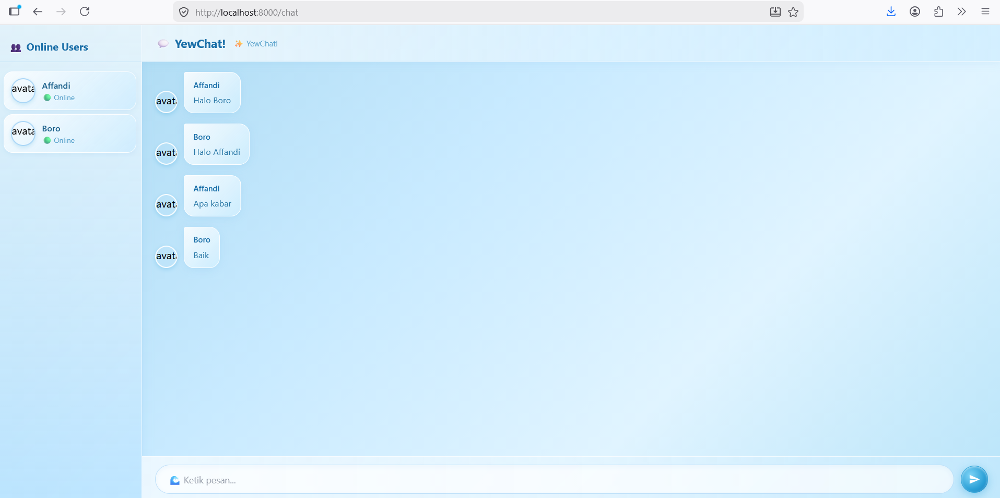

*Tab Affandi — menampilkan percakapan lengkap antara Affandi dan Boro melalui Rust server*

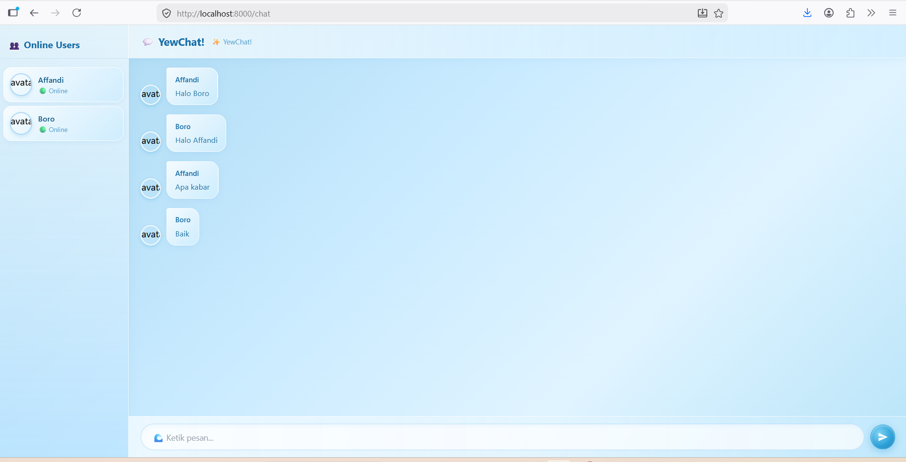

*Tab Boro — menerima semua pesan dari Affandi dan berhasil membalas*

---

### Pendapat: JavaScript vs Rust

**JavaScript/TypeScript** lebih mudah untuk disetup dan dikembangkan dengan cepat.
Ekosistem npm yang lengkap, sintaks yang familiar, dan tidak perlu memikirkan
tipe data secara ketat membuat prototyping jauh lebih cepat.

**Rust** lebih unggul dalam hal performa dan keamanan memori. Server Rust tidak
membutuhkan garbage collector, lebih efisien dalam menangani banyak koneksi
bersamaan, dan compiler Rust memastikan tidak ada data race atau memory leak.
Namun setup-nya lebih kompleks, terutama karena masalah kompatibilitas versi
seperti yang dialami di tutorial ini.

Untuk production dengan beban tinggi, saya lebih memilih **Rust** karena
keamanan dan efisiensinya. Namun untuk pengembangan cepat dan prototyping,
**JavaScript/TypeScript** tetap lebih praktis dan mudah.