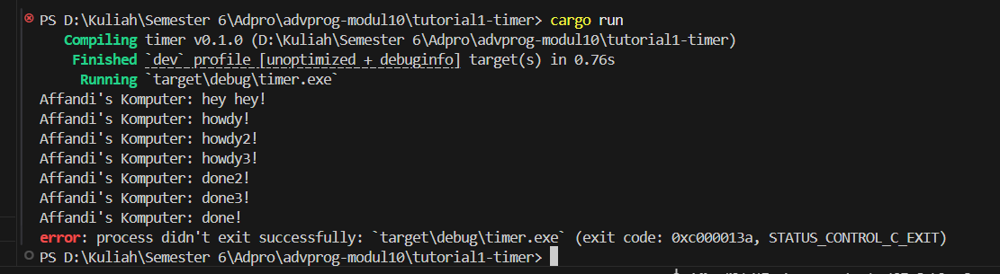

# Tutorial 1: Timer

## Experiment 1.1: Original timer from the book

Program ini mengimplementasikan async executor sederhana dari buku 
Asynchronous Programming in Rust. Program mencetak "howdy!" lalu 
menunggu 2 detik menggunakan TimerFuture sebelum mencetak "done!".

## Experiment 1.2: Understanding how it works


Setelah menambahkan `println!("hey hey!")` setelah `spawner.spawn()`,
output yang muncul adalah:
```
Affandi's Komputer: howdy!
Affandi's Komputer: hey hey!
Affandi's Komputer: done!
```

Hal ini terjadi karena `spawner.spawn()` hanya mendaftarkan task ke dalam queue executor tanpa langsung menjalankannya. Task baru benar-benar dijalankan ketika `executor.run()` dipanggil di akhir fungsi main. Oleh karena itu, `println!("hey hey!")` yang berada di luar async block dieksekusi terlebih dahulu setelah spawn selesai mendaftarkan task, tetapi sebelum executor mulai memproses task tersebut. Saat executor mulai berjalan, ia memproses task secara berurutan yaitu mencetak "howdy!", menunggu timer 2 detik, lalu mencetak "done!". Ini membuktikan bahwa spawner dan executor bekerja secara terpisah dimana spawner hanya mendaftarkan task sedangkan executor yang benar-benar menjalankannya.


## Experiment 1.3: Multiple Spawn and removing drop

Dengan menambahkan 3 spawn sekaligus, ketiga task dijalankan secara 
bersamaan oleh executor. Output yang muncul adalah howdy1, howdy2, 
howdy3 hampir bersamaan, lalu setelah 2 detik muncul done1, done2, 
done3 juga hampir bersamaan. Hal ini terjadi karena executor memproses 
semua task yang ada di queue secara concurrent.

Ketika `drop(spawner)` ada, executor mengetahui bahwa tidak akan ada 
task baru yang masuk sehingga setelah semua task selesai diproses, 
`executor.run()` berhenti dan program selesai dengan normal.

Ketika `drop(spawner)` dihapus/di-comment, executor tidak pernah tahu 
kapan harus berhenti menunggu task baru. Akibatnya `executor.run()` 
akan terus menunggu selamanya (hang/blocking) meskipun semua task 
sudah selesai diproses. Program tidak akan pernah berhenti kecuali 
dipaksa berhenti dengan Ctrl+C.

Kesimpulannya, `spawner` berfungsi untuk mendaftarkan task, `executor` 
berfungsi untuk menjalankan task, dan `drop(spawner)` berfungsi sebagai 
sinyal bahwa tidak ada task baru yang akan didaftarkan sehingga executor 
tahu kapan harus berhenti.


